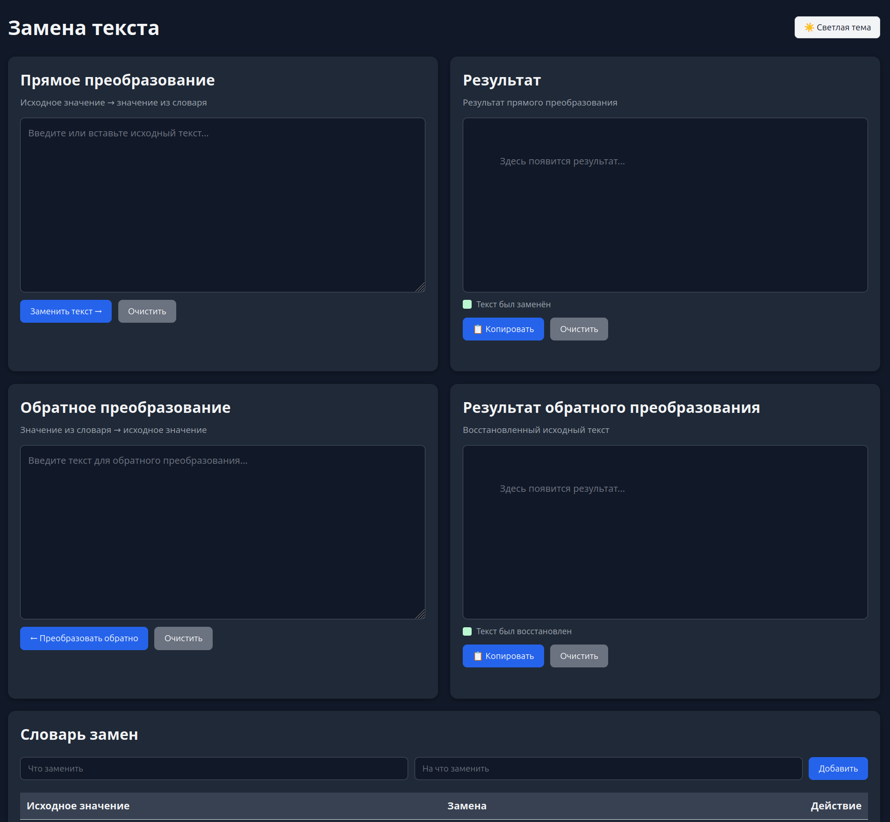
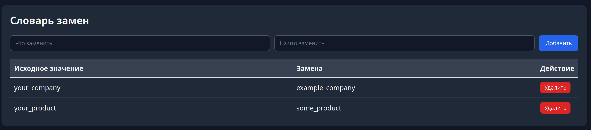

# text-replacer
add new words to data/dictionary.json  
docker compose up -d --build  
or  
DICTIONARY_FILE=data/dictionary.json  
pip install requirements.txt  
python3 app.py  



Upd dictionary from file `data/dictionary.json`   
example: 
```
{
  "your_product": "some_product",
  "your_company": "example_company"
}
```
or  in web-ui

